# Identifying the type of Migraine based on various symptoms using Machine Learning

## Overview

The project is a classification type project using a dataset for Migraine Classification which is authored by Emir Yarkin Yaman on Kaggle. 

https://www.kaggle.com/datasets/weinoose/migraine-classification

The main objective of the project is to be able to use machine learning to accurately determine which type of migraine a patient is having based on a variety of symptoms. This can be very beneficial in the diagnostic process in the field of medicine.

In this project, we will determine which machine learning algorithm will be useful with this dataset.

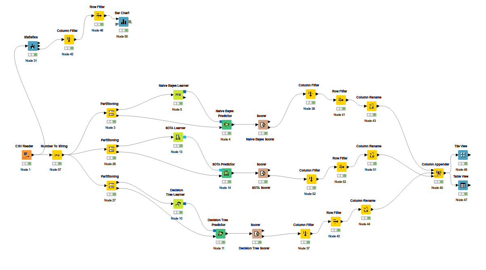

## Columns

- Age
- Duration
- Frequency
- Location
- Character
- Intensity
- Nausea
- Vomit
- Phonophobia
- Photophobia
- Visual
- Sensory
- Dysphasia
- Dysarthria
- Vertigo
- Tinnitus
- Hypoacusis
- Diplopia
- Defect
- Ataxia
- Conscience
- Paresthesia
- DPF
- Type

## Methods

Since our dataset is in the .CSV format, we must use the CSV reader node to access it.

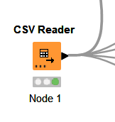

### Data Understanding

We can try to visualize our dataset to properly understand the dataset we are working with. To achieve this, we can use a few nodes.

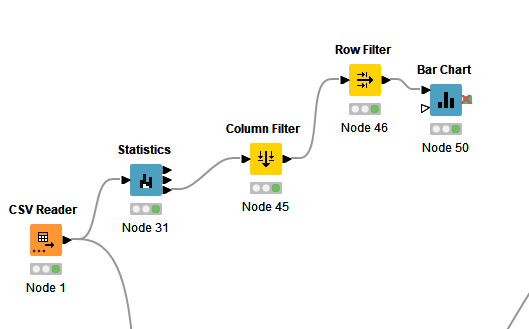

First we connect the reader into the statistics so we can output the Occurence table, then we connect that to the column and row filters so we can get our desired result. Lastly, we use the Bar Chart node to export our data in a visual format, which in this case is a bar chart.

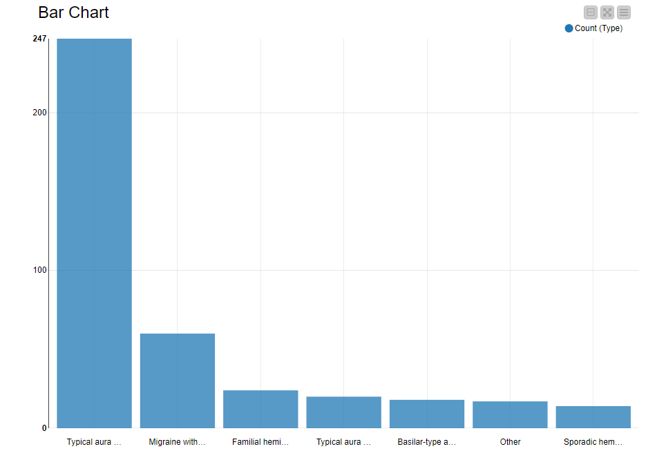

Here we can see the different classifications of our migraine type and how many times they appear in the given dataset out of the 400 entries.

### Feeding our data to our machine learning algorithms

#### Data Cleaning

Fortunately the dataset that is provided has already been cleaned and properly categorized by the original author. However, there's one more thing we can do.

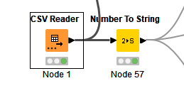

Since most of our columns are supposed to be a boolean type (0 for not present, 1 for present) we can convert these columns from integer type to string type.

#### Connecting to an algorithm

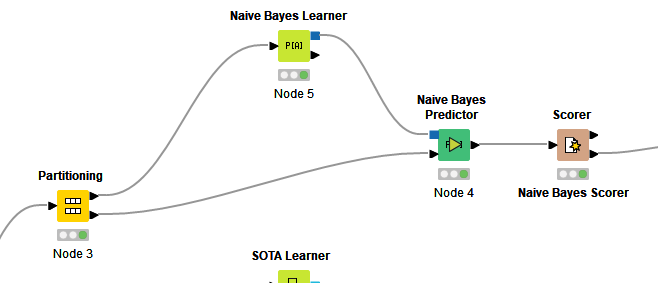

We first lead the data from the Number to String node into the partitioner, which will split our dataset into two, one of which will go into the learner and the other will go into the predictor. In this case, we will be using the Naive Bayes model. The scorer node at the end will the prediction and accuracy results.

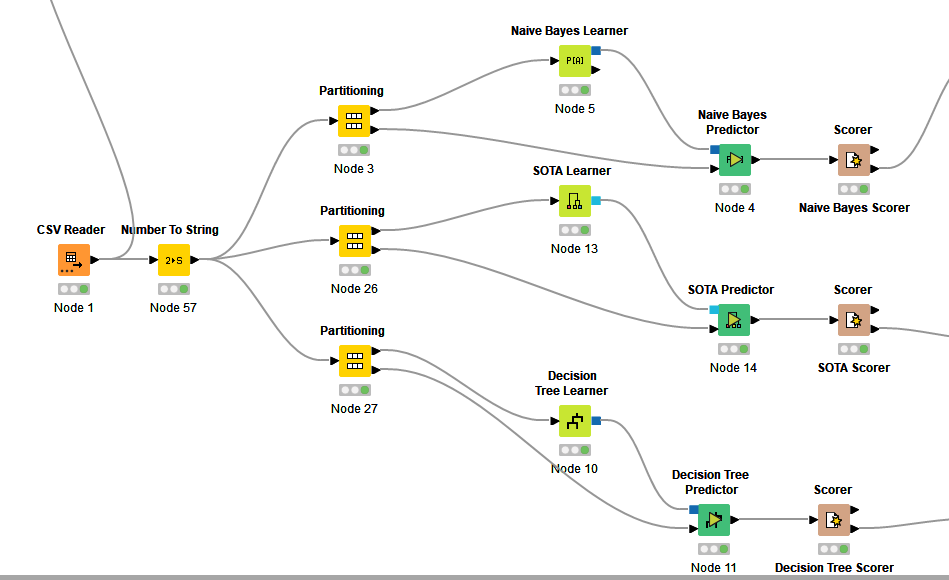

We repeat the same process for other models, I will be using SOTA and Decision Tree models. Their respective scorer nodes will output the prediction and accuracy results.

### Comparing the results

#### Cleaning up 

We can use the Accuracy statistics to find the accuracy of the models we used. However, the resulting table from the scorer contains unnecessary information, so we will need to filter it.

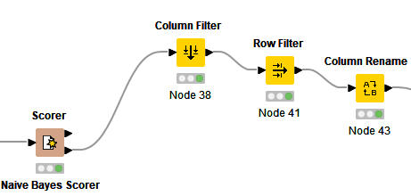

We use the Column filter and row filter nodes to get rid of the unneeded columns and rows and then use Column rename node to rename our column.
 
After the filtering, we will be left with this.

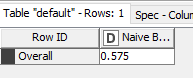

We can then simply repeat the process for the other models in a similar fashion.

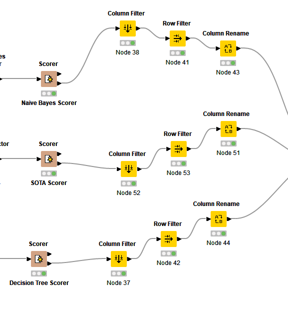

#### Combining the results and comparing

We can use the Column Appender node to combine our adjusted results and combine it into a singular table which we can use along with another node to compare our results. In this case, I will be using the Tile View and the Table View node.

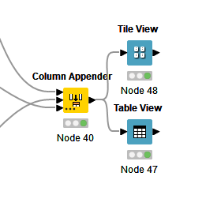

Finally, we can take a look at the views and determine which model would be best suited for us.

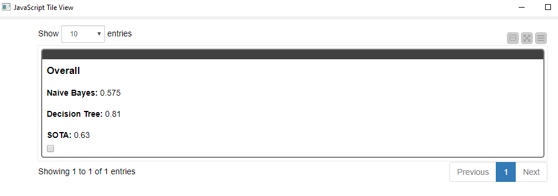
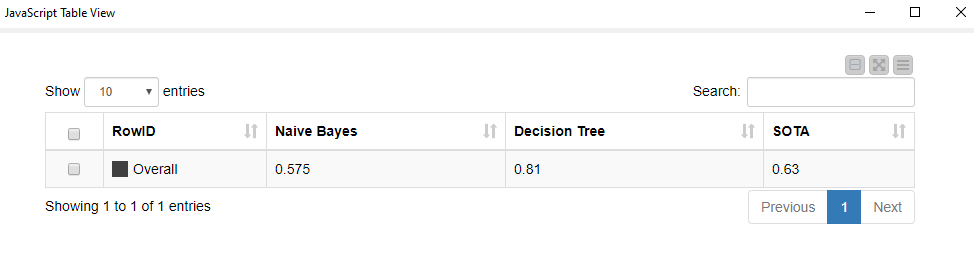

In our case, Decision tree seems to have the best accuracy results with 81% accurate results.

### Conclusion
In this project, I used KNIME to determine which machine learning model is the most suitable to be used for the provided dataset.

### Author
Khaled Wangbuesa - 641431021